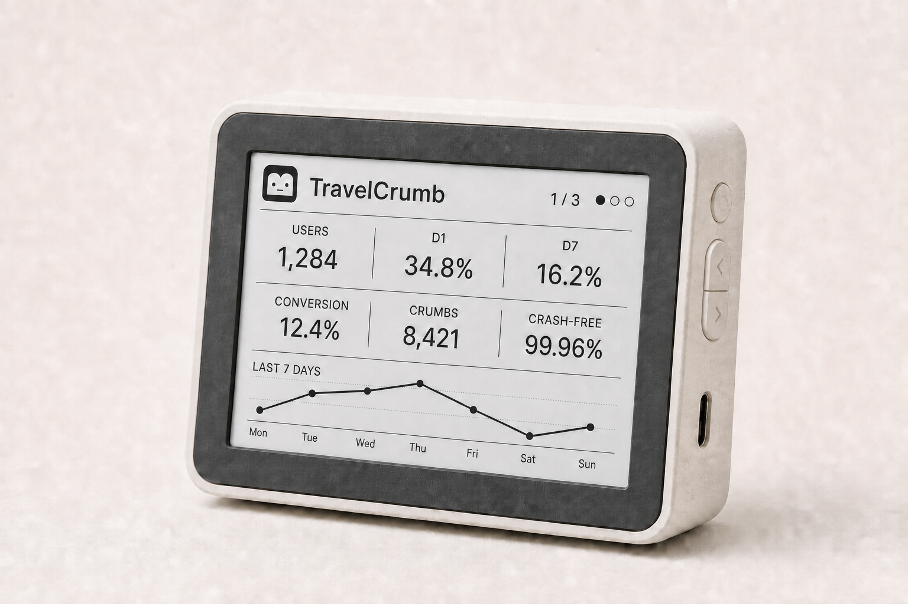
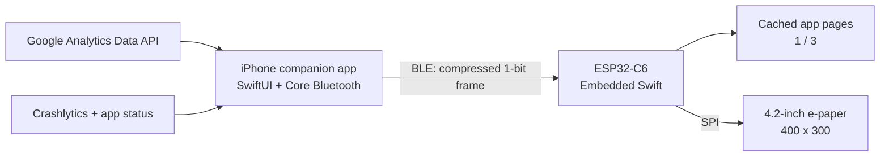
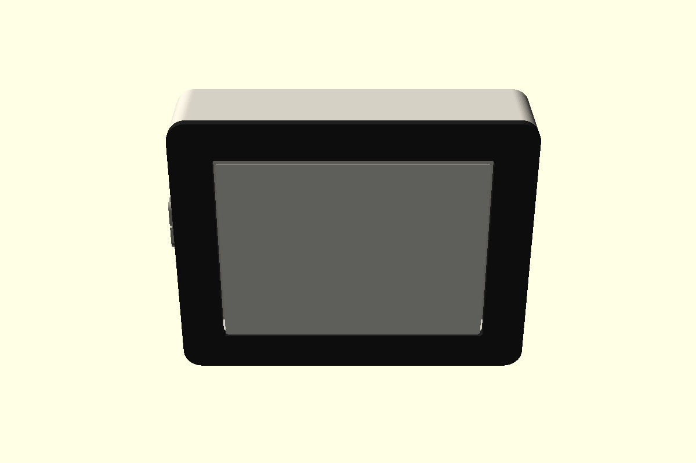
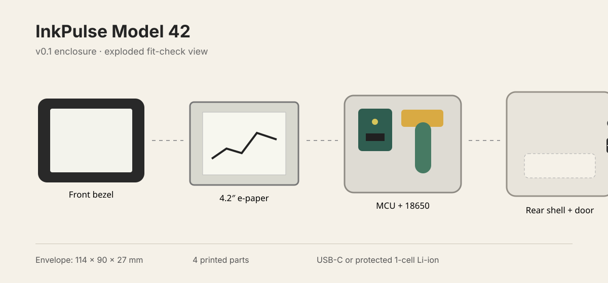

# InkPulse



InkPulse is a compact desktop device that shows TravelCrumb app health and Google Analytics 4 product metrics on a 4.2-inch e-paper display. The iPhone companion app retrieves and calculates the data, renders a 400 × 300 monochrome dashboard, and sends it to Embedded Swift firmware over Bluetooth Low Energy.

> This repository is a **v0.1 product, hardware, and 3D-printing concept**. The electrical design and battery-life target are not production specifications until they have been validated on a physical prototype.

## Product model

| Item | v0.1 model |
| --- | --- |
| Project name | InkPulse |
| Product face | TravelCrumb analytics dashboard |
| Model | InkPulse Model 42 |
| Purpose | TravelCrumb app health, retention, conversion, and content activity |
| Display | 4.2-inch, 400 × 300, black-and-white e-paper |
| Connectivity | Bluetooth Low Energy first; Wi-Fi is a later option |
| Update path | The iPhone renders and sends a compressed 1-bit frame |
| Controls | One action button plus a two-way previous/next rocker |
| Enclosure | Approximately 114 × 90 × 27 mm, landscape desktop format |
| Power | USB-C 5 V or one removable protected 3.7 V 18650 cell |
| Firmware | Embedded Swift with ESP-IDF C interoperability |

The default dashboard contains:

- Total registered users
- Day 1 and Day 7 retention
- New-user-to-first-crumb conversion
- Successfully created crumbs in the selected period
- Crash-free users
- Multi-app pagination and the current page position
- Battery, connection, and last-sync status

## Metric definitions

The display uses product-specific metrics instead of a generic GA4 `EVENTS` total.

| Display label | Definition | Initial data source |
| --- | --- | --- |
| `USERS` | Total registered TravelCrumb accounts | TravelCrumb backend |
| `D1` | Percentage of a new-user cohort that returns on the next calendar day | GA4 cohort report |
| `D7` | Percentage of a new-user cohort that returns on calendar day 7 | GA4 cohort report |
| `CONVERSION` | New users who successfully create their first crumb within 24 hours ÷ all new users in the same cohort | Derived from `first_open` and `crumb_created` |
| `CRUMBS` | Successful crumb creations in the selected period | GA4 `eventCount` filtered to `crumb_created`; the backend should become the production source of truth |
| `CRASH-FREE` | Percentage of active users who experienced no crash in the selected period | Firebase Crashlytics dashboard or BigQuery export |

`EVENTS` was removed because it combines unrelated analytics events such as screen views, sessions, and button taps. `CRUMBS` directly represents the TravelCrumb behavior the product is intended to encourage.

See [Product metrics](docs/METRICS.md) for the recommended dashboard hierarchy, formulas, and future pages.

## System architecture



The device never stores Google OAuth tokens, service-account keys, or crash-reporting credentials. The iPhone app or a separate backend handles API authentication and sends only display pixels and minimal configuration to the device.

## Hardware specification

| Component | Proposed part | Key specification / reason |
| --- | --- | --- |
| MCU | Seeed Studio XIAO ESP32-C6 | 160 MHz RISC-V, 512 KB SRAM, 4 MB Flash, BLE 5.3, Wi-Fi 6, USB-C, and single-cell battery charging |
| Display | Waveshare 4.2-inch e-Paper Module V2 (B/W) | 400 × 300, SPI, partial refresh, and near-zero display retention power |
| Battery | Protected 18650 Li-ion, 3.7 V, 2,500–3,500 mAh | Removable and capable of cable-free operation |
| Battery connection | Single 18650 holder with JST-PH 2-pin connector | Fixed polarity and serviceable wiring |
| Action input | One momentary button | Short press to refresh; long press to pair |
| Navigation input | Two-way rocker over two tactile switches | Previous/next app dashboard |
| Power switch | SPST slide switch | Disconnects the battery for storage and transport |
| Enclosure | 3D-printed PETG or PLA with optional M2 inserts | Three parts: front bezel, rear shell, and battery door |

### Power behavior

- With USB-C connected, the XIAO ESP32-C6 operates from USB power and charges the single-cell battery through its onboard power-management circuit.
- With USB-C disconnected, it operates from the protected 18650 cell connected to the BAT input.
- **Never charge alkaline AA/AAA cells, unprotected cells, or mixed cell types/states.** The v0.1 prototype is designed for one protected rechargeable Li-ion cell only.
- Before designing a production PCB, validate reverse-polarity protection, branch overcurrent protection, charging temperature, actual charge current, and enclosure temperature.
- The initial battery-life target is at least 30 days with a 3,000 mAh cell and low-power scheduling. This is a target, not a verified claim.

See the [bill of materials](hardware/BOM.csv) and [wiring plan](hardware/WIRING.md) for component and connection details.

## 3D model





The repository includes the editable OpenSCAD source and printable STL exports.

- [`hardware/cad/InkPulse.scad`](hardware/cad/InkPulse.scad) — parametric source model
- `hardware/cad/stl/front-bezel.stl` — front bezel
- `hardware/cad/stl/rear-shell.stl` — rear enclosure
- `hardware/cad/stl/battery-door.stl` — removable battery door
- `hardware/cad/stl/navigation-rocker.stl` — previous/next rocker cap
- [`hardware/cad/README.md`](hardware/cad/README.md) — print orientation and STL export instructions

The model starts from the Waveshare module PCB dimensions of 103.0 × 78.5 mm and active display dimensions of 84.8 × 63.6 mm. Measure the exact purchased module revision, connector, cable, cell, and manufacturing tolerances before the final print.

## Software boundary

### iPhone companion app

1. The user connects the appropriate GA4 property and app-health source.
2. The app reads GA4 reports, cohort data, crumb activity, and crash-free users.
3. It calculates the product metrics and renders a 400 × 300 monochrome dashboard.
4. It packages one or more named app pages, compresses each frame, and sends them in BLE characteristic chunks.

### Embedded Swift firmware

1. ESP-IDF provides the BLE and SPI drivers.
2. Embedded Swift owns pairing, frame validation, and the device state machine.
3. The firmware caches the verified pages and moves to the previous or next app when the rocker is pressed.
4. It applies only complete frames to the e-paper display and then returns to deep sleep.
5. The firmware pins its Swift nightly toolchain version because the Embedded Swift ABI is not yet stable.

## v0.1 acceptance criteria

- [ ] Bring up an Embedded Swift LED and SPI test on XIAO ESP32-C6
- [ ] Show 400 × 300 full-refresh and partial-refresh test patterns
- [ ] Transfer a 15 KB frame from iPhone over BLE and validate its CRC
- [ ] Display real registered users, D1, D7, first-crumb conversion, crumb count, and crash-free users
- [ ] Cache at least three app pages and navigate them with wraparound previous/next controls
- [ ] Validate USB-C charging, battery-only boot, and low-voltage shutdown
- [ ] Print the enclosure and check display, USB-C, action button, rocker, and battery-door tolerances
- [ ] Measure a 24-hour power profile and a 30-day projected profile

## Design references

- [Embedded Swift documentation](https://docs.swift.org/embedded/documentation/embedded/) — language mode and toolchain scope
- [Integrating Embedded Swift with platforms](https://docs.swift.org/embedded/documentation/embedded/integratingwithplatforms/) — RISC-V ESP32-C3/C6/P4 support
- [Swift Embedded Examples](https://github.com/swiftlang/swift-embedded-examples) — ESP32-C6 and ESP-IDF examples
- [XIAO ESP32-C6 documentation](https://wiki.seeedstudio.com/xiao_esp32c6_getting_started/) — memory, wireless, USB-C, and battery power
- [Waveshare 4.2-inch e-Paper documentation](https://www.waveshare.com/wiki/4.2inch_e-Paper_Module_Manual) — dimensions, resolution, SPI, and refresh behavior
- [Google Analytics Data API quickstart](https://developers.google.com/analytics/devguides/reporting/data/v1/quickstart) — GA4 authentication and `runReport`
- [Firebase Crashlytics reliability metrics](https://firebase.google.com/docs/crashlytics/crash-free-metrics) — crash-free users and sessions
- [Apple Core Bluetooth](https://developer.apple.com/documentation/corebluetooth) — iPhone BLE communication
- [TravelCrumb on the App Store](https://apps.apple.com/us/app/travelcrumb-travel-budget/id1330194842) — public product identity and app icon

## Repository structure

```text
InkPulse/
├── docs/                  # Product renderings, App Store icon, and diagrams
├── hardware/
│   ├── BOM.csv            # v0.1 bill of materials
│   ├── WIRING.md          # Power and SPI connections
│   └── cad/               # OpenSCAD source and STL exports
└── README.md
```
