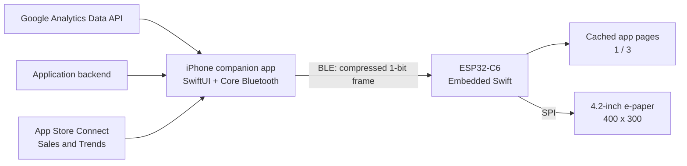

# InkPulse


InkPulse is a compact desktop device that shows configurable product metrics, Google Analytics 4 retention data, and current-month App Store proceeds on a 4.2-inch e-paper display. The iPhone companion app retrieves and calculates the data, renders a 400 × 300 monochrome dashboard, and sends it to Embedded Swift firmware over Bluetooth Low Energy.

> This repository is a **v0.1 product, hardware, and 3D-printing concept**. The electrical design and battery-life target are not production specifications until they have been validated on a physical prototype.

The bundled product rendering illustrates one app-specific configuration. The app icon, product name, metric labels, and values are replaceable without changing the enclosure or display pipeline.

## Product model

| Item | v0.1 model |
| --- | --- |
| Project name | InkPulse |
| Product face | Configurable application analytics dashboard |
| Model | InkPulse Model 42 |
| Purpose | At-a-glance retention, conversion, activity, and revenue monitoring |
| Display | 4.2-inch, 400 × 300, black-and-white e-paper |
| Connectivity | Bluetooth Low Energy first; Wi-Fi is a later option |
| Update path | The iPhone renders and sends a compressed 1-bit frame |
| Controls | One action button plus a two-way previous/next rocker |
| Enclosure | Approximately 125 × 101 × 40 mm, landscape desktop format |
| Colorway | Cobalt-blue front and rear enclosure with matte-black controls and screen gasket |
| Power | USB-C 5 V or one removable protected 3.7 V 18650 cell |
| Firmware | Embedded Swift with ESP-IDF C interoperability |

The default dashboard contains:

- Total registered users
- Day 1 and Day 7 retention
- New-user-to-primary-action conversion
- Successful primary actions in the selected period
- Estimated App Store proceeds for the current calendar month
- Multi-app pagination and the current page position
- Last-successful-sync freshness, such as `UPDATED 10 MIN AGO`
- Battery and connection status

## Metric definitions

The display uses product-specific metrics instead of a generic GA4 `EVENTS` total.

| Display label | Definition | Initial data source |
| --- | --- | --- |
| `USERS` | Total registered application accounts | Application backend |
| `D1` | Percentage of a new-user cohort that returns on the next calendar day | GA4 cohort report |
| `D7` | Percentage of a new-user cohort that returns on calendar day 7 | GA4 cohort report |
| `CONVERSION` | New users who complete the application's primary action within 24 hours ÷ all new users in the same cohort | Derived from `first_open` and an app-defined success event |
| `ACTIVITY` | Successful primary actions in the selected period | GA4 `eventCount` filtered to the app-defined success event; the backend should become the production source of truth |
| `REVENUE` | Estimated developer proceeds in the current calendar month, after applicable taxes and Apple's commission | App Store Connect Sales and Trends proceeds report |
| `UPDATED … AGO` | Elapsed time since the last fully successful fetch and rendered-frame update | Companion-app sync state |

`EVENTS` is not recommended because it combines unrelated analytics events such as screen views, sessions, and button taps. `ACTIVITY` should represent the app-specific behavior the product is intended to encourage.

See [Product metrics](docs/METRICS.md) for the recommended dashboard hierarchy, formulas, and future pages.

## System architecture



The device never stores Google OAuth tokens, service-account keys, or App Store Connect credentials. The iPhone app or a separate backend handles API authentication and sends only display pixels and minimal configuration to the device.

## Hardware specification

| Component | Proposed part | Key specification / reason |
| --- | --- | --- |
| MCU | Seeed Studio XIAO ESP32-C6 | 160 MHz RISC-V, 512 KB SRAM, 4 MB Flash, BLE 5.3, Wi-Fi 6, USB-C, and single-cell battery charging |
| Display | Waveshare 4.2-inch e-Paper Module V2 (B/W) | 400 × 300, SPI, partial refresh, and near-zero display retention power |
| Battery | Protected 18650 Li-ion, 3.7 V, 2,500–3,500 mAh | Removable and capable of cable-free operation |
| Battery connection | MPD BH-18650-W protected-cell holder | 77.7 × 20.9 × 21.31 mm chassis-mount holder with wire leads |
| Action input | Omron B3F-1000 tactile switch | 6 × 6 × 4.3 mm, 0.98 N, normally open |
| Navigation input | Printed two-way rocker over two Omron B3F-1000 switches | Previous/next app dashboard with separate physical contacts |
| Power switch | C&K 1101M2S5AQE2 slide switch | Right-angle SPDT with Q silver contacts rated 6 A at 28 V DC, used as a battery disconnect |
| Enclosure | 3D-printed PETG with M2 inserts and screws | Cobalt-blue front/rear shell, matte-black controls and screen gasket, electronics tray, and positively retained battery door |

### Power behavior

- With USB-C connected, the XIAO ESP32-C6 operates from USB power and charges the single-cell battery through its onboard power-management circuit.
- With USB-C disconnected, it operates from the protected 18650 cell connected to the BAT input.
- The MPD holder is designed for protected 18650 cells. Confirm the purchased cell's diameter, length, polarity, and protection circuit before installation.
- **Never charge alkaline AA/AAA cells, unprotected cells, or mixed cell types/states.** The v0.1 prototype is designed for one protected rechargeable Li-ion cell only.
- The slide switch disconnects the battery branch; USB-C can still power the controller while the battery is disconnected.
- Before designing a production PCB, validate reverse-polarity protection, branch overcurrent protection, charging temperature, actual charge current, connector polarity, and enclosure temperature.
- The initial battery-life target is at least 30 days with a 3,000 mAh cell and low-power scheduling. This is a target, not a verified claim.

See the [bill of materials](hardware/BOM.csv) and [wiring plan](hardware/WIRING.md) for component and connection details.

## Prototype purchase guide

The links below are reference purchase sources for the mechanically locked v0.1 parts. Indicative prices were checked on August 16, 2026, are shown in USD, and exclude shipping, tax, duties, tools, and any commercial 3D-printing service. Prices and availability vary by destination; these are not affiliate links.

| Part | Qty used | Reference purchase link | Listed price | Allocated to one device |
| --- | ---: | --- | ---: | ---: |
| Seeed Studio XIAO ESP32-C6 | 1 | [Seeed Studio](https://www.seeedstudio.com/Seeed-Studio-XIAO-ESP32C6-p-5884.html) | $5.20 each | $5.20 |
| Waveshare 4.2-inch e-Paper Module V2, black/white | 1 | [Waveshare](https://www.waveshare.com/4.2inch-e-paper-module.htm) | $34.99 each | $34.99 |
| EBL protected button-top 18650, 3.7 V, 3,000 mAh | 1 cell | [EBL official store](https://www.eblofficial.com/products/brc-18650-batteries) | $9.26 per 2-pack | $4.63 |
| MPD BH-18650-W holder | 1 | [DigiKey](https://www.digikey.com/en/products/detail/mpd-memory-protection-devices/BH-18650-W/3029217) | $3.64 each | $3.64 |
| C&K 1101M2S5AQE2 slide switch | 1 | [DigiKey](https://www.digikey.com/en/products/detail/c-k/SWITCH-1101M2S5AQE2/99505) | $8.48 each | $8.48 |
| Omron/Aratas B3F-1000 tactile switch | 3 | [DigiKey](https://www.digikey.com/en/products/detail/aratas-formerly-omron-components/B3F-1000/33150) | $0.35 each | $1.05 |
| Blue and black 1.75 mm PETG | About 140 g total | [Prusament PETG color range](https://prusament.com/materials/prusament-petg/) | $29.99 per 1 kg spool | About $4–5 |

The locked electronic parts total approximately **$57.99 per device**. Allow another **$12–22** per device for the allocated PETG, PTC fuse, perfboard or carrier PCB, display harness, wire, insulation, inserts, screws, nuts, foam, and consumables. The resulting **one-device prototype material estimate is $70–80**.

A first order is more expensive because the reference battery is sold as a two-pack and the blue/black enclosure requires two filament colors. Expect approximately **$120–155 at checkout** when buying two full PETG spools and normal retail packs of the remaining hardware. Subsequent units consume only a fraction of those supplies.

Before ordering, confirm that the display is the 103 × 78.5 mm black-and-white module with its SPI driver board—not a raw panel, Pico-specific board, or multicolor variant. The battery link is a dimensional reference, not an electrical certification: measure the purchased protected cell, confirm polarity and holder fit, and perform supervised charging and thermal validation. The PTC, harness, carrier, fasteners, and insulation remain intentionally supplier-neutral until the first physical fit test locks their exact models.

## 3D model


The repository includes the editable OpenSCAD source and printable STL exports.

- [`hardware/cad/InkPulse.scad`](hardware/cad/InkPulse.scad) — parametric source model
- `hardware/cad/stl/front-bezel.stl` — front bezel
- `hardware/cad/stl/rear-shell.stl` — rear enclosure with case standoffs and switch retention
- `hardware/cad/stl/electronics-tray.stl` — captured hardware tray and display foam lands
- `hardware/cad/stl/battery-door.stl` — rail-guided, screw-retained battery door
- `hardware/cad/stl/action-button.stl` — action/refresh button cap
- `hardware/cad/stl/navigation-rocker.stl` — pivoting previous/next rocker
- `hardware/cad/stl/switch-carrier.stl` — three-switch carrier and rocker axle support
- [`hardware/cad/README.md`](hardware/cad/README.md) — print orientation and STL export instructions
- [`hardware/cad/VALIDATION.md`](hardware/cad/VALIDATION.md) — mesh, component-stack, slicing, and physical-validation evidence

The model uses manufacturer dimensions for the Waveshare display PCB, XIAO ESP32-C6, MPD battery holder, Omron switches, and C&K power switch. It also contains visual-only component envelopes for collision inspection. That makes the repository suitable for a first engineering print, but it is not proof of physical fit: measure the purchased revisions, print the fit-critical parts, and complete an electrical and thermal prototype before treating the enclosure as production-ready.

## Software boundary

### iPhone companion app

1. The user connects the appropriate GA4 property, application backend, and App Store Connect reporting source.
2. The app reads cohort data, primary-action activity, registered-user totals, and current-month proceeds.
3. It calculates the product metrics and renders a 400 × 300 monochrome dashboard.
4. It packages one or more named app pages, compresses each frame, and sends them in BLE characteristic chunks.

### Embedded Swift firmware

1. ESP-IDF provides the BLE and SPI drivers.
2. Embedded Swift owns pairing, frame validation, and the device state machine.
3. The firmware caches the verified pages and moves to the previous or next app when the rocker is pressed.
4. It applies only complete frames to the e-paper display and then returns to deep sleep.
5. The firmware pins its Swift nightly toolchain version because the Embedded Swift ABI is not yet stable.

## v0.1 acceptance criteria

- [ ] Bring up an Embedded Swift LED and SPI test on XIAO ESP32-C6
- [ ] Show 400 × 300 full-refresh and partial-refresh test patterns
- [ ] Transfer a 15 KB frame from iPhone over BLE and validate its CRC
- [ ] Display real registered users, D1, D7, primary-action conversion, activity count, and current-month proceeds
- [ ] Cache at least three app pages and navigate them with wraparound previous/next controls
- [ ] Validate USB-C charging, battery-only boot, and low-voltage shutdown
- [ ] Print the enclosure and check display, USB-C, action button, rocker, and battery-door tolerances
- [ ] Measure a 24-hour power profile and a 30-day projected profile

## Design references

- [Embedded Swift documentation](https://docs.swift.org/embedded/documentation/embedded/) — language mode and toolchain scope
- [Integrating Embedded Swift with platforms](https://docs.swift.org/embedded/documentation/embedded/integratingwithplatforms/) — RISC-V ESP32-C3/C6/P4 support
- [Swift Embedded Examples](https://github.com/swiftlang/swift-embedded-examples) — ESP32-C6 and ESP-IDF examples
- [XIAO ESP32-C6 documentation](https://wiki.seeedstudio.com/xiao_esp32c6_getting_started/) — memory, wireless, USB-C, and battery power
- [Waveshare 4.2-inch e-Paper documentation](https://www.waveshare.com/wiki/4.2inch_e-Paper_Module_Manual) — dimensions, resolution, SPI, and refresh behavior
- [MPD BH-18650-W drawing](https://www.memoryprotectiondevices.com/datasheets/BH-18650-W/BH-18650-W-datasheet.pdf) — protected-cell holder envelope and mounting pattern
- [Omron B3F tactile-switch datasheet](https://omronfs.omron.com/en_US/ecb/products/pdf/en-b3f.pdf) — action and navigation switch dimensions and travel
- [C&K 1000 Series slide-switch datasheet](https://www.ckswitches.com/media/1429/1000.pdf) — `1101M2S5AQE2` dimensions, ordering code, and Q-contact rating
- [Google Analytics Data API quickstart](https://developers.google.com/analytics/devguides/reporting/data/v1/quickstart) — GA4 authentication and `runReport`
- [App Store Connect Sales and Trends metrics](https://developer.apple.com/help/app-store-connect/reference/reporting/sales-and-trends-metrics-and-dimensions/) — proceeds definition and reporting dimensions
- [Apple Core Bluetooth](https://developer.apple.com/documentation/corebluetooth) — iPhone BLE communication

## Repository structure

```text
InkPulse/
├── docs/                  # Product renderings, App Store icon, and diagrams
├── hardware/
│   ├── BOM.csv            # v0.1 bill of materials
│   ├── WIRING.md          # Power and SPI connections
│   └── cad/               # OpenSCAD source and STL exports
└── README.md
```
